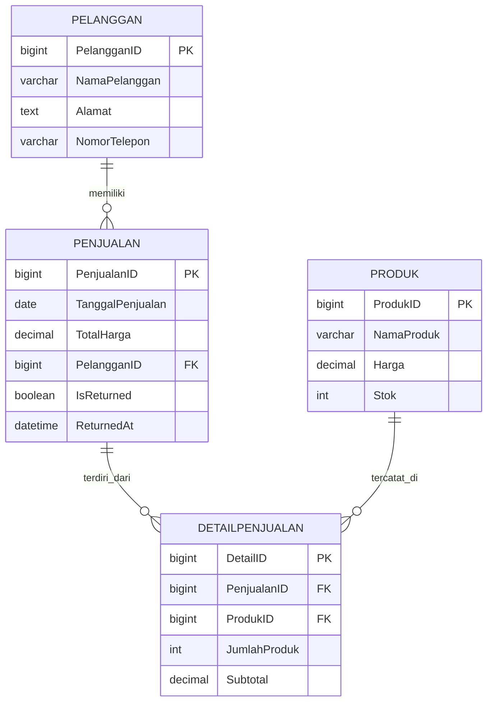

# NoreXo Kasir

Project ini di-reset menjadi sistem kasir berbasis Laravel dengan 4 entitas utama:
- `pelanggan`
- `produk`
- `penjualan`
- `detailpenjualan`

Tujuannya untuk pencatatan transaksi, pengelolaan data pelanggan, dan kontrol stok secara akurat.

## Struktur Entitas (DBML)

```dbml
Table pelanggan {
  PelangganID int [pk, increment]
  NamaPelanggan varchar(255)
  Alamat text
  NomorTelepon varchar(15)
}

Table produk {
  ProdukID int [pk, increment]
  NamaProduk varchar(255)
  Harga decimal(10,2)
  Stok int
}

Table penjualan {
  PenjualanID int [pk, increment]
  TanggalPenjualan date
  TotalHarga decimal(10,2)
  PelangganID int
}

Table detailpenjualan {
  DetailID int [pk, increment]
  PenjualanID int
  ProdukID int
  JumlahProduk int
  Subtotal decimal(10,2)
}

Ref: penjualan.PelangganID > pelanggan.PelangganID
Ref: detailpenjualan.PenjualanID > penjualan.PenjualanID
Ref: detailpenjualan.ProdukID > produk.ProdukID
```

## Langkah Kerja (1-8)

### 1. Analisis Kebutuhan
Data yang disimpan:
- Pelanggan: identitas, alamat, kontak.
- Produk: nama produk, harga, stok.
- Penjualan: tanggal transaksi, total, pelanggan terkait.
- Detail Penjualan: item produk per transaksi, jumlah, subtotal.

Kebutuhan operasional kasir:
- Menambahkan item ke keranjang.
- Menyimpan transaksi sekaligus update stok.
- Menampilkan riwayat penjualan.

### 2. Perancangan Skema
Relasi utama:
- `pelanggan` 1..n `penjualan`
- `penjualan` 1..n `detailpenjualan`
- `produk` 1..n `detailpenjualan`

#### Diagram ERD (Visual)



### 3. Pembuatan Tabel
Diimplementasikan pada migration:
- `database/migrations/2026_01_01_000005_create_pelanggan_table.php`
- `database/migrations/2026_01_01_000010_create_products_table.php`
- `database/migrations/2026_01_01_000020_create_sales_table.php`
- `database/migrations/2026_01_01_000030_create_sale_details_table.php`

### 4. Definisi Relasi (PK/FK)
- PK: `PelangganID`, `ProdukID`, `PenjualanID`, `DetailID`
- FK:
  - `penjualan.PelangganID -> pelanggan.PelangganID`
  - `detailpenjualan.PenjualanID -> penjualan.PenjualanID`
  - `detailpenjualan.ProdukID -> produk.ProdukID`

### 5. Input Data Sampel
Data sampel disediakan di:
- `database/seeders/DatabaseSeeder.php`

Data awal:
- 2 pelanggan
- 3 produk
- 1 transaksi contoh + 2 detail item

### 6. Pengujian Query
Contoh query pengujian:

```sql
SELECT p.PenjualanID, p.TanggalPenjualan, p.TotalHarga, pl.NamaPelanggan
FROM penjualan p
LEFT JOIN pelanggan pl ON pl.PelangganID = p.PelangganID
ORDER BY p.PenjualanID DESC;

SELECT d.DetailID, d.PenjualanID, pr.NamaProduk, d.JumlahProduk, d.Subtotal
FROM detailpenjualan d
JOIN produk pr ON pr.ProdukID = d.ProdukID
WHERE d.PenjualanID = 1;

SELECT *
FROM pelanggan
WHERE NamaPelanggan LIKE '%Siti%'
   OR NomorTelepon LIKE '%0823%';

SELECT ProdukID, NamaProduk, Stok
FROM produk
WHERE Stok < 10
ORDER BY Stok ASC;
```

### 7. Optimasi
Indeks untuk performa sudah ditambahkan pada migration:
- `pelanggan.NamaPelanggan`
- `pelanggan.NomorTelepon`
- `produk.NamaProduk`
- `produk.Stok`
- `penjualan.TanggalPenjualan`
- `penjualan.PelangganID`
- `detailpenjualan.PenjualanID`
- `detailpenjualan.ProdukID`
- unique composite `detailpenjualan(PenjualanID, ProdukID)`

### 8. Dokumentasi Sistem
Alur kasir aplikasi:
1. Kasir buka Dashboard Kasir.
2. Kasir pilih produk dan jumlah, lalu tambahkan ke keranjang.
3. Kasir pilih pelanggan lama atau isi pelanggan baru.
4. Sistem menyimpan transaksi (`penjualan`) + detail item (`detailpenjualan`) dalam transaksi database.
5. Sistem mengurangi stok produk sesuai item terjual.
6. Riwayat transaksi bisa dilihat di halaman `Riwayat Penjualan`.

## Menjalankan Project

```bash
composer install
npm install
cp .env.example .env
php artisan key:generate
php artisan migrate:fresh --seed
php artisan serve
```

Akses:
- Dashboard kasir: `/`
- Riwayat transaksi: `/riwayat`

## Catatan Desain
UI mengikuti gaya NoreXo:
- Kartu putih, border halus, aksen biru.
- Layout 2 kolom (produk dan ringkasan keranjang).
- Responsif untuk desktop dan mobile.
